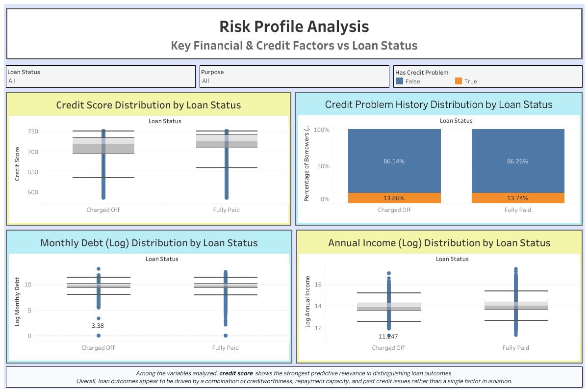

# Bank Loan Portfolio Analysis

This project analyzes a retail bank loan portfolio to understand loan performance, borrower risk characteristics, and segment-level credit risk patterns.  
The analysis combines Python-based exploratory data analysis (EDA) with interactive dashboards built in Tableau.

The goal of this project is not predictive modeling, but to demonstrate a complete analytical workflow: from raw data exploration and cleaning, to insight-driven visualization and interpretation.

---

## Project Overview

This analysis focuses on answering the following high-level questions:

- What is the overall distribution of loan outcomes (Fully Paid vs Charged Off)?
- How do borrower financial and credit characteristics differ across loan outcomes?
- Which loan purposes and customer segments exhibit higher credit risk?
- Does prior credit problem history amplify risk within specific loan segments?

The project is structured to reflect a realistic analytics workflow commonly used in internal risk reporting or portfolio monitoring.

---

## Data Source

The dataset used in this project is publicly available on Kaggle:

- **Source**: Kaggle – *Credit Train Dataset*  
  https://www.kaggle.com/datasets/zaurbegiev/my-dataset/data?select=credit_train.csv

The dataset represents a sample retail loan portfolio and is used strictly for educational and portfolio demonstration purposes.

---

## Analytical Workflow

The project follows a structured, end-to-end process:

### 1. Data Understanding & Exploration (Python)
- Initial inspection of loan status distribution
- Review of borrower attributes such as credit score, income, debt, and credit history
- Identification of key variables related to loan outcomes

### 2. Data Cleaning & Feature Preparation
- Removal of inconsistencies and unused fields
- Creation of derived features (e.g., log-transformed income and debt)
- Export of a cleaned dataset for visualization use

### 3. Exploratory Data Analysis (EDA)
- Distribution analysis by loan status
- Comparison of borrower profiles across Fully Paid vs Charged Off loans
- Segment-level exploration by loan purpose and credit problem history

All steps above are documented in the Jupyter notebook [`bank_loan_portfolio_analysis.ipynb`](./bank_loan_portfolio_analysis.ipynb).

### 4. Interactive Dashboard Development (Tableau)
- Creation of multiple dashboards to present findings clearly
- Focus on portfolio-level overview, risk profiling, and segment analysis
- Interactive filters to explore patterns across loan status, purpose, and borrower characteristics

### 5. Insight Synthesis
- Key observations and interpretations are summarized separately in [`insights.md`](./insights.md)
- Insights are written to reflect a business and risk-analysis perspective rather than technical output only

---

## Interactive Dashboards (Tableau Public)

The dashboards are published on Tableau Public and can be explored interactively:

- **Portfolio Overview**  <br>
  https://public.tableau.com/app/profile/fernando.namora/viz/BankLoanPortfolioAnalysis/PortfolioOverview <br>
  

- **Risk Profile Analysis**  <br>
  https://public.tableau.com/app/profile/fernando.namora/viz/BankLoanPortfolioAnalysis/RiskProfileAnalysis <br>
  

- **Customers / Segment Risk Profile**  <br>
  https://public.tableau.com/app/profile/fernando.namora/viz/BankLoanPortfolioAnalysis/CustomersProfile <br>
  

Screenshots of each dashboard are also included in the [`images/`](images/) folder for quick reference.

---

## Repository Structure

```text
bank-loan-portfolio-analysis/
│
├─ images/                         # Dashboard screenshots
├─ bank_loan_portfolio_analysis.ipynb
├─ bank_loan_portfolio_cleaned.csv
├─ credit_train.csv                # Original dataset
├─ insights.md                     # Key findings and interpretations
├─ README.md
├─ .gitignore
```

---

## Notes

- This project emphasizes analytical reasoning and communication rather than model building.
- All analyses are based on historical data and should not be interpreted as real-world credit policy recommendations.
- The dashboards and insights are designed to mirror common portfolio monitoring and risk analysis use cases.
